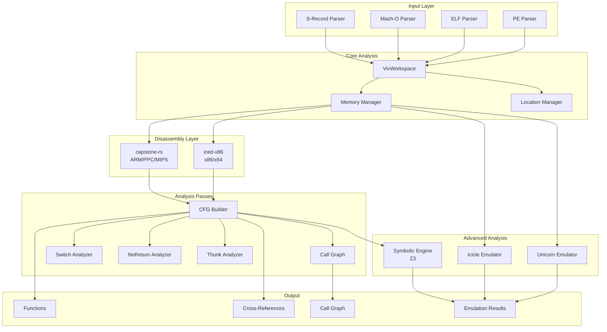
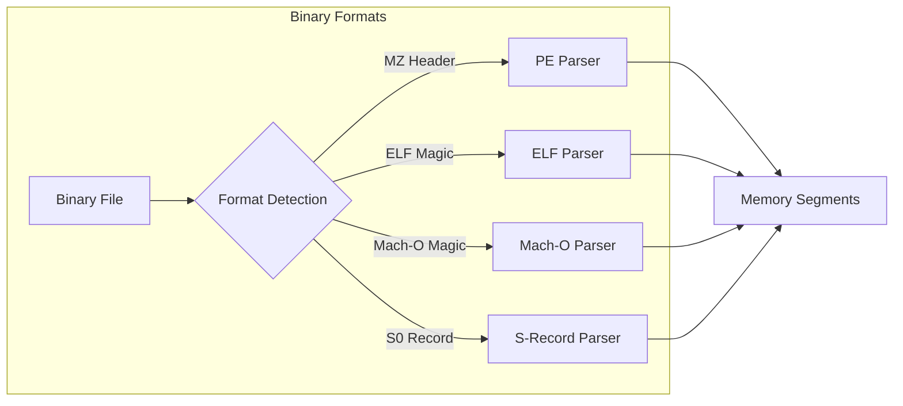
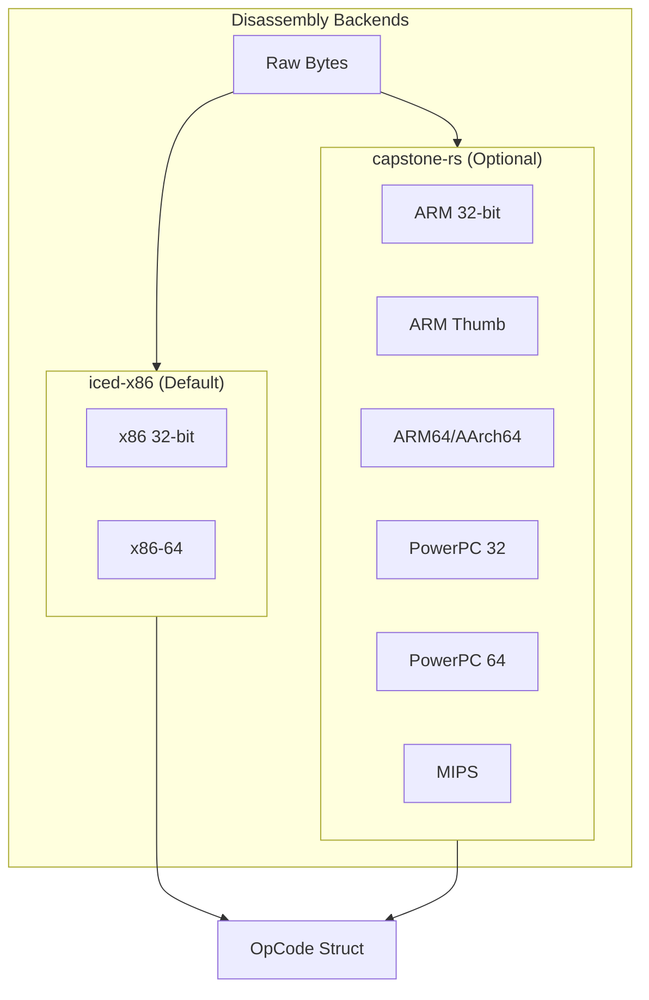
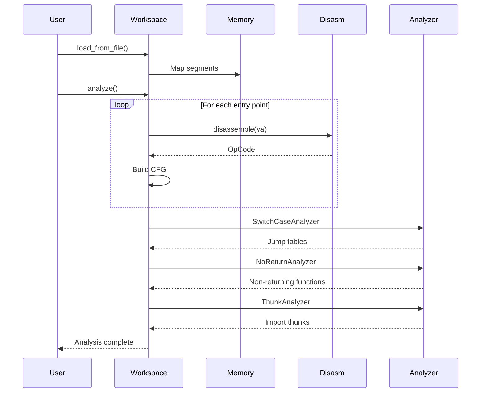
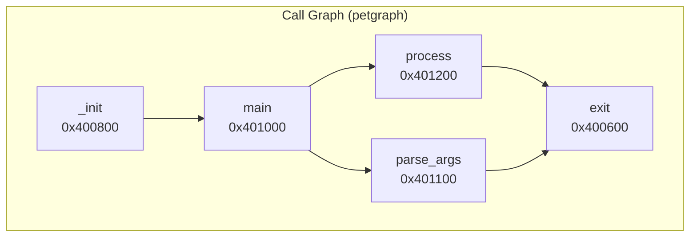
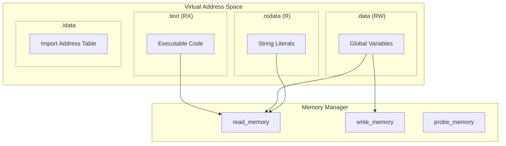
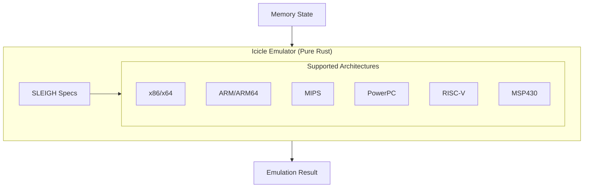
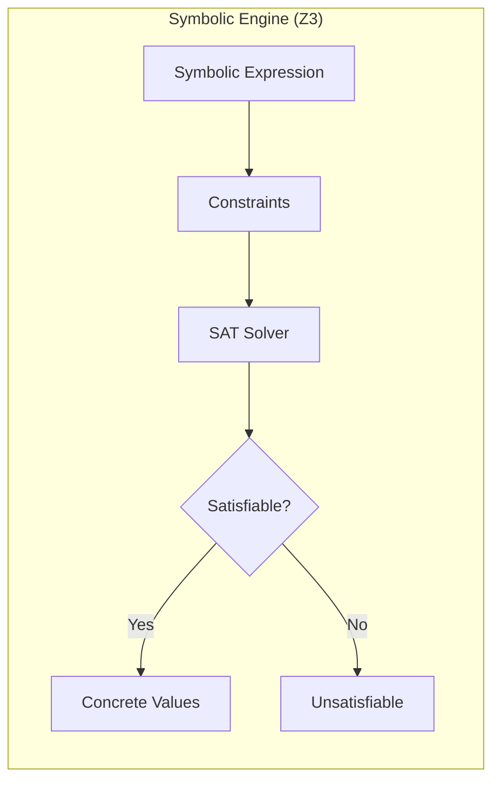
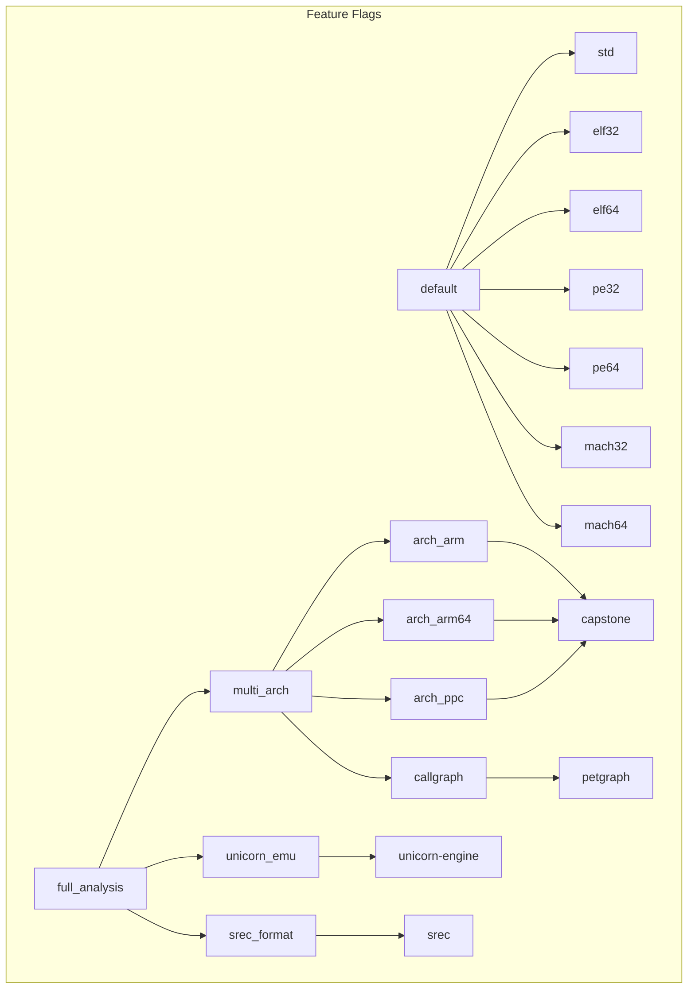
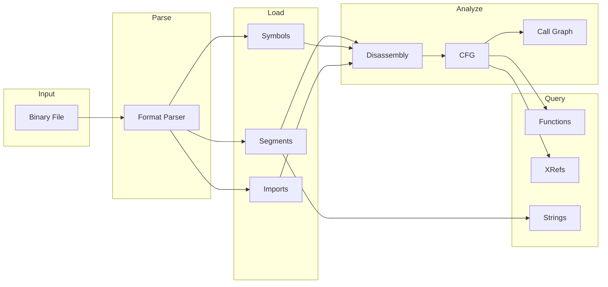

# Vivisect-rs Architecture

This document describes the architecture of vivisect-rs, a Rust library for static binary analysis.

## High-Level Architecture



## Component Overview

### Input Layer

The input layer handles parsing of various binary formats:



| Parser | Module | Formats |
|--------|--------|---------|
| PE | `src/pe/` | `.exe`, `.dll`, `.sys` |
| ELF | `src/elf/` | Linux executables, `.so` |
| Mach-O | `src/mach/` | macOS executables, `.dylib` |
| S-Record | `src/srec_parser.rs` | Motorola SREC firmware |

### Disassembly Layer

Architecture-specific disassembly is handled by two backends:



### Analysis Pipeline



### Call Graph Structure



The call graph is built using `petgraph::DiGraph`:

```rust
pub struct CallGraph {
    graph: DiGraph<i32, ()>,      // Node = function VA
    va_to_node: HashMap<i32, NodeIndex>,
    node_to_va: HashMap<NodeIndex, i32>,
}
```

## Memory Model



## Emulation Architecture



| Engine | Type | License | Architectures |
|--------|------|---------|---------------|
| Icicle | Pure Rust | MIT | x86, ARM, MIPS, PowerPC, RISC-V, MSP430 |

## Symbolic Execution



## Feature Flag Dependencies



## Module Structure

```
src/
├── lib.rs                 # Library entry point, Object enum
├── workspace.rs           # VivWorkspace - main analysis container
├── analysis.rs            # Analysis passes
├── emulator.rs            # OpCode, Operand types
├── memory.rs              # Memory trait and implementations
├── constants.rs           # Architecture and flag constants
├── codegraph.rs           # Call graph (petgraph-based)
├── srec_parser.rs         # S-Record file parser
├── icicle_emu.rs          # Pure Rust CPU emulation (icicle)
├── symboliks.rs           # Symbolic execution (Z3)
│
├── pe/                    # PE format parsing
│   ├── mod.rs
│   ├── header.rs
│   ├── optional_header.rs
│   ├── section_table.rs
│   ├── export.rs
│   └── exception.rs
│
├── elf/                   # ELF format parsing
│   ├── mod.rs
│   ├── header.rs
│   ├── program_header.rs
│   ├── section_header.rs
│   ├── sym.rs
│   ├── dynamic.rs
│   └── note.rs
│
├── mach/                  # Mach-O format parsing
│   ├── mod.rs
│   ├── header.rs
│   ├── constants.rs
│   ├── exports.rs
│   └── imports.rs
│
└── envi/                  # Architecture modules
    └── archs/
        ├── mod.rs
        ├── i386/          # x86 32-bit (iced-x86)
        ├── amd64/         # x86-64 (iced-x86)
        ├── arm/           # ARM/Thumb/ARM64 (capstone)
        └── ppc/           # PowerPC 32/64 (capstone)
```

## Data Flow


