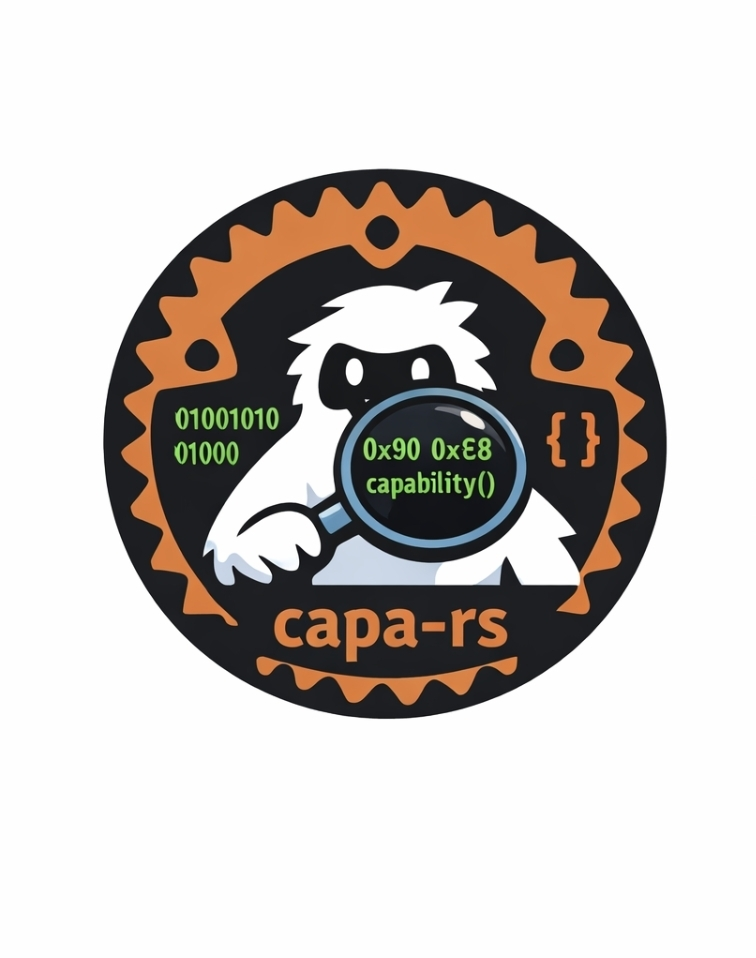

<div align="center">

<a href="https://github.com/mandiant/capa">
  
</a>

# capa-rs

Rust reimplementation of [CAPA](https://github.com/mandiant/capa) — Mandiant's open-source tool for identifying capabilities in executable files.

[](https://github.com/yeti-sec/capa-rs/actions)
[](https://github.com/yeti-sec/capa-rs/releases)
[](https://github.com/yeti-sec/capa-rs/releases)
[](LICENSE)
[](https://www.rust-lang.org/)
[](https://github.com/mandiant/capa-rules)

Analyzes PE, ELF, .NET, and shellcode using CAPA's YAML rule format.

</div>


<details>
<summary>Per-sample demos</summary>

| Sample | Demo |
|--------|------|
| .NET assembly |  |
| ELF x86-64 |  |
| Golang PE32 |  |
| GraalVM PE64 |  |
| Cobalt Strike beacon |  |
| Cobalt Strike beacon v2 |  |

</details>

## Quick Start

```bash
# Clone and build
git clone https://github.com/yeti-sec/capa-rs.git
cd capa-rs
cargo build --release

# Analyze a binary
./target/release/capa-rs -r capa-rules malware.exe
```

## Features

- **Fast**: 10-50x faster than Python CAPA using iced-x86 disassembler (>250 MB/s throughput)
- **Single Binary**: No Python runtime required (~5MB statically linked)
- **Compatible**: Uses existing CAPA YAML rules (1000+ bundled)
- **Pure Rust**: No C/C++ dependencies in default build
- **Cross-Platform**: Builds on Windows, Linux, and macOS
- **.NET Support**: CIL bytecode and metadata analysis via [dotscope](https://github.com/BinFlip/dotscope)
- **Integration Ready**: JSON output for downstream tooling

## Installation

### Prerequisites

Install Rust via [rustup](https://rustup.rs):
```bash
curl --proto '=https' --tlsv1.2 -sSf https://sh.rustup.rs | sh
```

### Build

```bash
# Default build (x86/x64 analysis)
cargo build --release

# With .NET CIL analysis
cargo build --release --features dotnet
```

The binary will be at `target/release/capa-rs` (or `capa-rs.exe` on Windows).

### Using just (optional)

[just](https://github.com/casey/just) provides convenient build commands:

```bash
cargo install just
just build-release          # Default release build
just build-release-dotnet   # With .NET support
```

## Usage

```bash
# Basic analysis (auto-detect format)
capa-rs -r capa-rules malware.exe

# JSON output
capa-rs -r capa-rules -j malware.exe

# Verbose output (show matched addresses)
capa-rs -r capa-rules -v malware.exe

# Filter by namespace
capa-rs -r capa-rules -n "anti-analysis" malware.exe

# Shellcode analysis (requires explicit format)
capa-rs -f sc64 -r capa-rules shellcode.bin    # 64-bit
capa-rs -f sc32 -r capa-rules shellcode.bin    # 32-bit

# .NET analysis (requires dotnet feature)
capa-rs -f dotnet -r capa-rules assembly.exe

# Export extracted features to JSON
capa-rs -r capa-rules --dump-features malware.exe > features.json

# Use pre-extracted features (skip disassembly)
capa-rs -r capa-rules -F features.json
```

### Supported Formats

| Format | Flag | Description |
|--------|------|-------------|
| Auto | `-f auto` | Auto-detect from file headers (default) |
| PE | `-f pe` | Windows PE executable |
| ELF | `-f elf` | Linux ELF executable |
| .NET | `-f dotnet` | .NET assembly (requires `dotnet` feature) |
| Shellcode 64 | `-f sc64` | Raw 64-bit x64 shellcode |
| Shellcode 32 | `-f sc32` | Raw 32-bit x86 shellcode |

## Project Structure

```
capa-rs/
├── crates/
│   ├── capa-core/       # Rule parsing, matching engine, output formatting
│   ├── capa-backend/    # Binary loading, disassembly, feature extraction
│   ├── capa-cli/        # Command-line interface
│   └── dotscope/        # .NET PE/CIL analysis library
├── capa-rules/          # CAPA YAML rules (1000+)
├── enhanced-dotnet-rules/  # Additional .NET-specific rules
├── docs/                # Rule-writing guides
├── justfile             # Build automation
└── ARCHITECTURE.md      # System design and diagrams
```

### Crate Overview

| Crate | Purpose |
|-------|---------|
| **capa-core** | Rule YAML parser, boolean matching engine, JSON/table output |
| **capa-backend** | PE/ELF loading (goblin), x86/x64 disassembly (iced-x86), IR lifting, feature extraction |
| **capa-cli** | CLI argument parsing, orchestration, format detection |
| **dotscope** | .NET metadata tables, CIL disassembly, type resolution |

## Feature Flags

| Feature | Build Command | Description |
|---------|--------------|-------------|
| default | `cargo build --release` | x86/x64 analysis via iced-x86 (pure Rust) |
| dotnet | `cargo build --release --features dotnet` | .NET CIL analysis via dotscope (pure Rust) |
| ida-backend | `cargo build --release --features ida-backend` | IDA Pro analysis backend via idalib-rs (requires IDA Pro 9.x) |

## IDA Pro Backend

The `ida-backend` feature enables [idalib-rs](https://github.com/binarly-io/idalib) as an analysis backend, giving capa-rs access to IDA Pro's disassembly, type information, and analysis results instead of the default iced-x86/goblin pipeline.

### Prerequisites

- **IDA Pro 9.x** installed with a valid license (tested against v9.2)
- **idalib-rs** checked out locally at `../idalib-rs` relative to the capa-rs workspace root (i.e., both repos side-by-side on your Desktop or working directory)
- **LLVM/Clang** — required by idalib-rs's bindgen step to generate FFI bindings from the IDA SDK headers. Install from the [LLVM releases page](https://github.com/llvm/llvm-project/releases) or your system package manager.

### Setup

**1. Clone idalib-rs and initialize the SDK submodule**

```bash
git clone https://github.com/binarly-io/idalib idalib-rs
cd idalib-rs
git submodule update --init --recursive
```

The IDA SDK is a public git submodule at `idalib-sys/sdk` (auto-fetched from GitHub if not present). Verify it initialized correctly — `idalib-sys/sdk/src/include/pro.h` must exist.

**2. Set environment variables**

Windows (PowerShell):
```powershell
$env:PATH = "C:\Program Files\LLVM\bin;C:\Program Files\IDA Professional 9.2;$env:PATH"
$env:IDADIR = "C:\Program Files\IDA Professional 9.2"
$env:LIBCLANG_PATH = "C:\Program Files\LLVM\lib"
```

Linux/macOS:
```bash
export PATH="/usr/lib/llvm-17/bin:$PATH"   # adjust LLVM version
export IDADIR="$HOME/ida-pro-9.2"
```

**3. Build with the IDA backend feature**

```bash
cargo build --release --features ida-backend
```

**4. Run with IDA backend**

```bash
capa-rs --backend ida -r capa-rules malware.exe
```

### Known Pain Points

#### Path to idalib-rs must be a sibling directory

The `capa-backend` crate references idalib via a relative path in `Cargo.toml`:

```toml
idalib = { path = "../../../idalib-rs/idalib", optional = true }
```

This expects idalib-rs to be checked out at the same level as the capa-rs workspace root (e.g., both under `Desktop/`). If you clone it elsewhere, update this path accordingly.

#### Windows: `/FORCE:UNRESOLVED` required for test binaries

On Windows, idalib links against the IDA SDK's stub `.lib` files at compile time, with the actual symbols resolved at runtime from `idalib.dll`/`ida.dll`. This means the SDK stubs leave some symbols intentionally unresolved. idalib-rs's own build script handles this by emitting `/FORCE:UNRESOLVED` to the linker — but this flag **does not automatically propagate** to test binary link steps in downstream crates.

`capa-backend/build.rs` re-emits this flag when `CARGO_FEATURE_IDA_BACKEND` is set so that `cargo test --features ida-backend` links successfully. If you see linker errors like:

```
error LNK2019: unresolved external symbol "public: int __cdecl func_t::compare..."
```

...it means the build script isn't running or the feature flag isn't being detected. Ensure `build.rs` exists in `crates/capa-backend/` and the feature is passed explicitly on the command line.

#### LLVM/Clang must be on PATH at build time

idalib-rs uses `autocxx`/`bindgen` to generate Rust FFI bindings from the IDA SDK C++ headers. This requires `clang` to be available at *build* time (not runtime). If you see errors like `failed to run custom build command for idalib-sys`, check:

```bash
clang --version   # must succeed
echo $LIBCLANG_PATH   # must point to LLVM lib dir
```

On Windows with the LLVM installer, `clang.exe` is typically at `C:\Program Files\LLVM\bin\clang.exe` and `LIBCLANG_PATH` should be `C:\Program Files\LLVM\lib`.

#### IDA license required at runtime

Building with `ida-backend` only requires the IDA SDK (no license). But *running* the binary — including `cargo test --features ida-backend` — initializes IDA Pro and requires a valid license. Tests will fail with a license error if IDA cannot validate. The message `Thank you for using IDA. Have a nice day!` in test output is normal — it's IDA's shutdown log.

#### .NET assemblies and the IDA backend

The IDA backend does **not** use `dotscope` for CIL feature extraction. Running `--backend ida` on a .NET binary uses IDA's native .NET support, which surfaces fewer capa-detectable features than the dotscope path and will typically produce near-zero rule matches.

For best results on .NET assemblies, build with `--features dotnet` and use the default goblin backend:

```bash
cargo build --release --features dotnet
capa-rs -r capa-rules assembly.exe          # goblin + dotscope (recommended)
capa-rs -r capa-rules -f dotnet assembly.exe  # force dotnet format detection
```

## Architecture

### Analysis Pipeline

```
Binary File
    |
    v
+------------------+     +-----------------+     +------------------+
|  Loader (goblin) | --> |  Lifter (iced /  | --> |    Extractor     |
|  PE/ELF parsing  |     |  capstone)       |     |  Feature harvest |
+------------------+     +-----------------+     +------------------+
                                                         |
    +----------------------------------------------------+
    |
    v
+------------------+     +-----------------+     +------------------+
|  Rule Parser     | --> |  Match Engine   | --> |  Output (JSON /  |
|  YAML -> AST     |     |  Boolean eval   |     |  table / verbose)|
+------------------+     +-----------------+     +------------------+
```

### Binary Loading (`capa-backend::loader`)

[goblin](https://github.com/m4b/goblin) parses PE and ELF headers, extracting:
- Import/export tables (with forwarded export resolution)
- Section headers and attributes
- Entry point and architecture detection
- .NET CLR header detection (COM descriptor directory)
- ASCII and UTF-16LE string extraction (min 4 chars)

Shellcode is loaded as a single executable section at offset 0 with no headers to parse.

### Disassembly & Lifting (`capa-backend::lifter`)

Two disassembly backends, selected automatically by architecture:

| Backend | Library | Architectures | Pure Rust |
|---------|---------|---------------|-----------|
| **iced-x86** (default) | [iced-x86](https://github.com/icedland/iced) | x86, x86-64 | Yes |
| **capstone** (fallback) | [capstone-rs](https://github.com/capstone-rust/capstone-rs) | ARM, AArch64, MIPS, PPC | No (C binding) |

The lifter performs recursive descent disassembly to produce an intermediate representation:

- **Function discovery**: Entry point, export addresses, call target analysis, PE `.pdata` exception table (x64), and function prologue pattern matching
- **Basic block construction**: Split at branches, calls, and jump targets with successor/predecessor edges
- **Loop detection**: Back-edge analysis on the basic block CFG to identify loop headers
- **Thunk resolution**: Single-`jmp` functions are identified and resolved to their IAT target
- **IAT mapping**: Import Address Table entries are mapped for indirect call resolution (`call [rip+disp]`)
- **String-at-address map**: Data section strings indexed by address for pointer-based string reference detection

Each instruction is lifted into `ILOperation` variants (`Assign`, `Store`, `Load`, `Branch`, `Xor`, `Other`) that the feature extractor consumes.

### .NET Analysis (`capa-backend::dotnet_extractor` + `dotscope`)

When the `dotnet` feature is enabled, [dotscope](https://github.com/BinFlip/dotscope) provides:

- **Metadata tables**: TypeDef, MethodDef, MemberRef, AssemblyRef parsing
- **User string heap** (`#US`): Resolves `ldstr` token operands to actual string literals
- **CIL disassembly**: Decodes IL instruction streams from method bodies (tiny + fat headers)
- **P/Invoke imports**: Native DLL imports via `DllImport` / `ImplMap`
- **Per-method features**: IL mnemonics, numeric constants, and string references scoped to individual methods for function-level rule matching

### Feature Extraction (`capa-backend::extractor`)

Features are harvested at file, function, basic block, and instruction scopes:

| Feature | Scope | Source |
|---------|-------|--------|
| API calls | basic block | Import table + thunk resolution + IAT indirect calls |
| Strings (ASCII/wide) | basic block | Data section string map, memory operand dereferencing |
| Numeric constants | basic block | Immediate operands from lifted instructions |
| Mnemonics | basic block | Instruction mnemonics (`mov`, `xor`, `call`, ...) |
| Sections | file | PE/ELF section names |
| Imports | file | Import table with A/W/Ex suffix normalization |
| Exports | file | Export table (including forwarded targets) |
| Characteristics | varies | See table below |
| Byte patterns | instruction | Raw instruction bytes |
| Offsets | basic block | Memory reference displacement values |
| .NET types/methods | file + function | dotscope metadata (with `dotnet` feature) |

**Characteristic detection:**

| Characteristic | How Detected |
|----------------|-------------|
| `nzxor` | XOR with different operands (not zeroing, not XOR 0) |
| `loop` | Back-edge in basic block CFG |
| `tight loop` | Loop header block with <= 10 instructions |
| `recursive call` | Function calls its own address |
| `stack string` | 4+ `mov` to stack with printable ASCII immediates |
| `indirect call` | `call` with no resolved target |
| `embedded pe` | MZ header + valid PE signature found after first 512 bytes |
| `cross section flow` | Branch target in a different PE/ELF section |
| `peb access` | FS/GS segment register access (Windows-specific) |
| `call $+5` | Shellcode get-EIP/RIP pattern |
| `forwarded export` | Export entry forwards to another DLL |
| `mixed mode` | .NET CLR header + native executable sections + exports |

### Rule Parsing & Matching (`capa-core`)

**Parser** (`capa-core::rule::parser`): Parses CAPA YAML rules into an AST of `FeatureNode` trees with boolean operators (`and`, `or`, `not`, `optional`), counting constraints (`count(api(...)): 2 or more`), and subscope operators (`instruction:`, `basic block:`, `function:`).

**Match Engine** (`capa-core::matcher::engine`):
- Parallel rule evaluation with [rayon](https://github.com/rayon-rs/rayon) thread pool
- Lock-free result collection via [DashMap](https://github.com/xacrimon/dashmap)
- Pre-compiled [Aho-Corasick](https://github.com/BurntSushi/aho-corasick) automaton for batch string matching
- Scope-aware evaluation: file-scope rules check merged features, function/basic-block scope rules iterate per-function
- API name normalization: `CreateFileW` -> `CreateFile`, `CreateFileExA` -> `CreateFileEx` + `CreateFile`

### Supported Analysis

#### Binary Formats

| Format | 32-bit | 64-bit | Loader |
|--------|--------|--------|--------|
| PE (Windows) | Yes | Yes | goblin |
| ELF (Linux) | Yes | Yes | goblin |
| .NET (CIL) | Yes | Yes | goblin + dotscope |
| Shellcode | Yes | Yes | Raw bytes (no headers) |

#### Architecture Support

| Architecture | Disassembler | Feature Flag | Pure Rust |
|--------------|-------------|--------------|-----------|
| x86 / x86-64 | iced-x86 | default | Yes |
| .NET CIL | dotscope | `dotnet` | Yes |
| ARM (32-bit) | capstone-rs | - | No |
| ARM64 / AArch64 | capstone-rs | - | No |
| MIPS | capstone-rs | - | No |
| PowerPC 32/64 | capstone-rs | - | No |

## Output Format

```json
{
  "matched_rules": 42,
  "total_rules": 1087,
  "capabilities": [
    {
      "name": "check for debugger via API",
      "namespace": "anti-analysis/anti-debugging",
      "matches": 3,
      "attack": ["T1622"]
    }
  ],
  "mitre_attack": ["T1622", "T1497.001"],
  "namespaces": {
    "anti-analysis/anti-debugging": ["check for debugger via API"]
  }
}
```

## Tests

Run all tests with `cargo test` or `just test`.

### capa-core (`crates/capa-core/tests/`)

| Test File | Description |
|-----------|-------------|
| `test_engine.rs` | Matching engine logic |
| `test_rules.rs` | Rule parsing and loading |
| `test_rules_extended.rs` | Extended rule parsing |
| `test_rules_insn_scope.rs` | Instruction-scope rule matching |
| `test_match.rs` | Match evaluation |
| `test_capabilities.rs` | Capability detection |
| `test_rule_features.rs` | Rule feature extraction |
| `test_output.rs` | Output formatting (JSON/table) |
| `test_serialization.rs` | Serialization and deserialization |

### capa-backend (`crates/capa-backend/tests/`)

| Test File | Description |
|-----------|-------------|
| `test_loader.rs` | Binary loader (PE/ELF) |
| `test_extractor_hashing.rs` | Extractor hashing |
| `test_strings.rs` | String extraction |
| `test_helpers.rs` | Helper utilities |

### dotscope (`crates/dotscope/tests/`)

| Test File | Description |
|-----------|-------------|
| `builders.rs` | Builder patterns |
| `crafted_1.rs` | Crafted .NET binary parsing |
| `fuzzer.rs` | Fuzz testing |
| `modify_add.rs` | Metadata modification (add) |
| `modify_basic.rs` | Metadata modification (basic) |
| `modify_heaps.rs` | Heap modification |
| `modify_impexp.rs` | Import/export modification |
| `modify_roundtrips_crafted2.rs` | Roundtrip tests (crafted binary) |
| `modify_roundtrips_method.rs` | Roundtrip tests (methods) |
| `modify_roundtrips_wbdll.rs` | Roundtrip tests (DLL) |
| `mono.rs` | Mono runtime compatibility |
| `roundtrip_asm.rs` | Assembly roundtrip |

> **Note:** Mono test fixtures are not included in the repository. See `crates/dotscope/tests/README.md` for setup instructions.

Additionally, many source files contain inline unit tests (`#[cfg(test)]` modules).

## Just Commands

Run `just --list` to see all available commands.

| Command | Description |
|---------|-------------|
| `just build` | Build with default features |
| `just build-release` | Build optimized release binary |
| `just build-release-dotnet` | Release build with .NET support |
| `just test` | Run all tests |
| `just run <file>` | Analyze a binary |
| `just run-json <file>` | Analyze with JSON output |
| `just run-dotnet <file>` | Analyze a .NET assembly |
| `just doc-open` | Generate and view API docs |
| `just lint` | Run clippy linter |
| `just fmt` | Format code |
| `just check-all` | Format check + lint + test |
| `just features` | Show available feature flags |

## Documentation

Guides for writing CAPA rules:

| Guide | Description |
|-------|-------------|
| [PE Rules Guide](docs/pe-rules-guide.md) | Writing rules for Windows PE binaries |
| [ELF Rules Guide](docs/elf-rules-guide.md) | Writing rules for Linux ELF binaries |
| [.NET Rules Guide](docs/dotnet-rules-guide.md) | Writing rules for .NET assemblies |
| [Shellcode Rules Guide](docs/shellcode-rules-guide.md) | Writing rules for raw shellcode |
| [Architecture](ARCHITECTURE.md) | System design with Mermaid diagrams |

## License

Apache-2.0 - see [LICENSE](LICENSE) for details.

## Acknowledgments

This project builds on the work of several open-source projects:

- [capa](https://github.com/mandiant/capa) by Mandiant — the original Python capability identification tool
- [capa-rules](https://github.com/mandiant/capa-rules) by Mandiant — the YAML rule corpus (bundled, Apache 2.0)
- [dotscope](https://github.com/BinFlip/dotscope) by Johann Kempter (BinFlip) — .NET PE/CIL analysis library
- [goblin](https://github.com/m4b/goblin) — PE/ELF/Mach-O binary parser
- [iced-x86](https://github.com/icedland/iced) — x86/x64 disassembler
- [capstone](https://github.com/capstone-engine/capstone) — multi-architecture disassembly framework
- [rayon](https://github.com/rayon-rs/rayon) — data parallelism library
- [DashMap](https://github.com/xacrimon/dashmap) — concurrent hash map for lock-free result collection
- [Aho-Corasick](https://github.com/BurntSushi/aho-corasick) — multi-pattern string matching

FLIRT signatures in `sigs/` were generated by Mandiant using Hex-Rays FLAIR tools from source data they collected (not derived from IDA Pro signatures).
